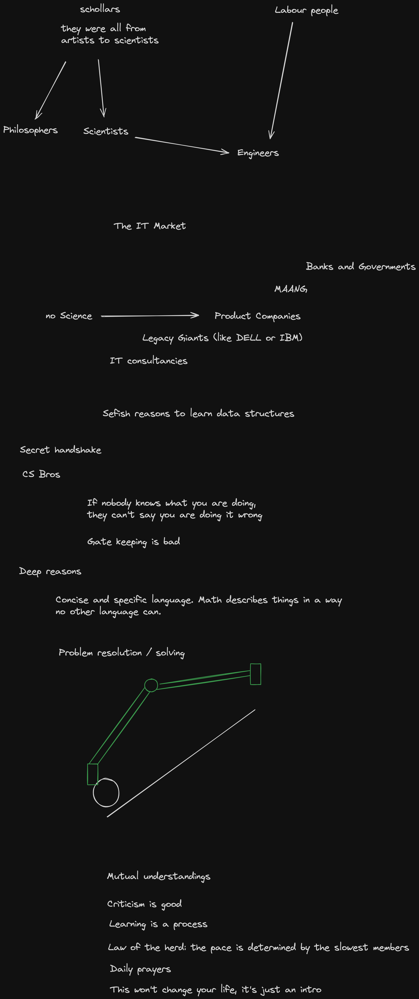
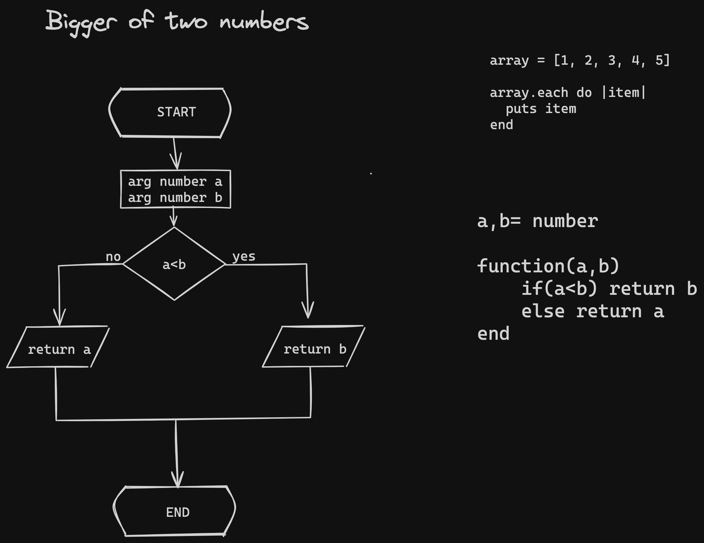

# data-structures-study
we don't know CS

## Session 1

## Session 2

### Flowcharts

### Ruby example of a for loop
[loop.rb](https://github.com/dandelarge/data-structures-study/blob/main/loop.rb)

## Session 3

### Bubblesort

#### Ruby version of bubblesort by Lucas
[bubble sort in ruby](https://github.com/dandelarge/data-structures-study/blob/main/lucas.bubblesort.rb)

#### Javascript version of bubblesort by Aykut
[Bubble sort in javascript](https://github.com/dandelarge/data-structures-study/blob/main/aykut.bubblesort.js)

## Session 4

### Analog computers vs Digital Computers

### Turing Machines

### Binary numeric System

### Logic gates

### Half Binary Adder

### Chaining Circuits

#### Full binary adder

#### Four bits adder

